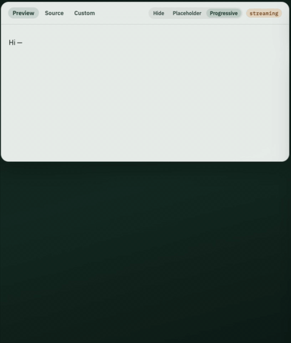

# interactive-markdown

[English](#english) | [中文](#中文)

---

<a id="english"></a>

## English

Stream-friendly Interactive Markdown: embed `choice` / `input` / `switch` / `action` in Markdown for AI chat and forms.



### Packages

| Package | Description |
|---|---|
| `@interactive-markdown/core` | Parse, strip, validate, serialize, interaction helpers |
| `@interactive-markdown/react` | `InteractiveMarkdown` React renderer |
| `@interactive-markdown/playground` | Local docs + streaming demo (private) |

### Quick Start

```bash
npm install @interactive-markdown/core @interactive-markdown/react
```

```tsx
import { InteractiveMarkdown } from "@interactive-markdown/react";

<InteractiveMarkdown
  source={aiText}
  streaming={isStreaming}
  interactive={{
    onChoice: (result) => {
      // result.values + result.block — compose your own message content， ref docs/spec.md
    },
    onInput: (result) => {},
    onSwitch: (result) => {},
    onAction: (result) => {
      // optional JSON context: result.block.data / result.block.dataError
    },
  }}
/>
```

#### Streaming

```tsx
<InteractiveMarkdown
  source={partialText}
  streaming
  incomplete="progressive" // "hide" | "placeholder" | "progressive"
/>
```

While `streaming` is true, trailing unclosed `:::` blocks are handled by `incomplete`:

| Value | Behavior |
|---|---|
| `hide` (default) | Do not render the pending block (legacy) |
| `placeholder` | Show a type skeleton |
| `progressive` | Grow the real widget as rows/attrs stabilize; not interactive until closed |

Optional `renderPending={(pending) => ...}` overrides the pending region.

#### History replay

```tsx
<InteractiveMarkdown
  source={aiText}
  answers={{ login: { values: ["phone"] } }}
  interactive={{ disabled: true }}
/>
```

### Syntax

```markdown
:::choice{id=login label="Which login method?" mode=single required hint="hint"}
- phone | Phone login
- oauth | Third-party login
:::

:::input{id=name label="Product name" placeholder=Example required}
:::

:::switch{id=notify label="Notifications" default=off}
:::

:::action{id=submit label="Confirm & continue"}
{"step":"next"}
:::

:::action{id=skip label="Skip for now"}
:::
```

Default UI order: **label → control → hint**. Quote attribute values that contain spaces. Action click payload context lives on `result.block.data` (or `dataError` if the body failed `JSON.parse`).

### Development

Requires Node 18+ .

```bash
npm install
npm test
npm run coverage
npm run build
npm run dev            # playground at http://localhost:5173
npm run build:playground
```

Spec: [docs/spec.md](./docs/spec.md)

### Non-goals

Not a chat SDK, not an LLM client, and not a business action registry.

### License

MIT

---

<a id="中文"></a>

## 中文

面向流式场景的交互式 Markdown：在 Markdown 中嵌入 `choice` / `input` / `switch` / `action`，适用于 AI 对话与表单。


### 包结构

| 包 | 说明 |
|---|---|
| `@interactive-markdown/core` | 解析、剥离、校验、序列化与交互辅助 |
| `@interactive-markdown/react` | `InteractiveMarkdown` React 渲染器 |
| `@interactive-markdown/playground` | 本地文档 + 流式演示（private） |

### 快速开始

```bash
npm install @interactive-markdown/core @interactive-markdown/react
```

```tsx
import { InteractiveMarkdown } from "@interactive-markdown/react";

<InteractiveMarkdown
  source={aiText}
  streaming={isStreaming}
  interactive={{
    onChoice: (result) => {
      // result.values + result.block — 自行组装消息内容，详细见：docs/spec.md
    },
    onInput: (result) => {},
    onSwitch: (result) => {},
    onAction: (result) => {
      // 可选 JSON 上下文：result.block.data / result.block.dataError
    },
  }}
/>
```

#### 流式渲染

```tsx
<InteractiveMarkdown
  source={partialText}
  streaming
  incomplete="progressive" // "hide" | "placeholder" | "progressive"
/>
```

`streaming` 为 true 时，末尾未闭合的 `:::` 块由 `incomplete` 处理：

| 取值 | 行为 |
|---|---|
| `hide`（默认） | 不渲染 pending 块（旧行为） |
| `placeholder` | 显示类型骨架 |
| `progressive` | 随行/属性稳定渐进渲染真实控件；闭合前不可交互 |

可选 `renderPending={(pending) => ...}` 覆盖 pending 区域。

#### 历史回放

```tsx
<InteractiveMarkdown
  source={aiText}
  answers={{ login: { values: ["phone"] } }}
  interactive={{ disabled: true }}
/>
```

### 语法

```markdown
:::choice{id=login label="你更倾向哪种登录方式？" mode=single required hint="说明"}
- phone | 手机号登录
- oauth | 第三方账号登录
:::

:::input{id=name label="产品名称" placeholder=示例 required}
:::

:::switch{id=notify label="消息通知" default=off}
:::

:::action{id=submit label="确认并继续"}
{"step":"next"}
:::

:::action{id=skip label="暂时跳过"}
:::
```

默认 UI 顺序：**label → 控件 → hint**。属性值含空格时请加引号。点击 action 时，可选 JSON 上下文在 `result.block.data`（正文非法 JSON 时为 `result.block.dataError`）。

### 开发

需要 Node 18+。

```bash
npm install
npm test
npm run coverage
npm run build
npm run dev            # playground：http://localhost:5173
npm run build:playground
```

规格说明：[docs/spec.md](./docs/spec.md)

### 非目标

不是聊天 SDK，不是 LLM 客户端，也不是业务动作注册表。

### 许可证

MIT
