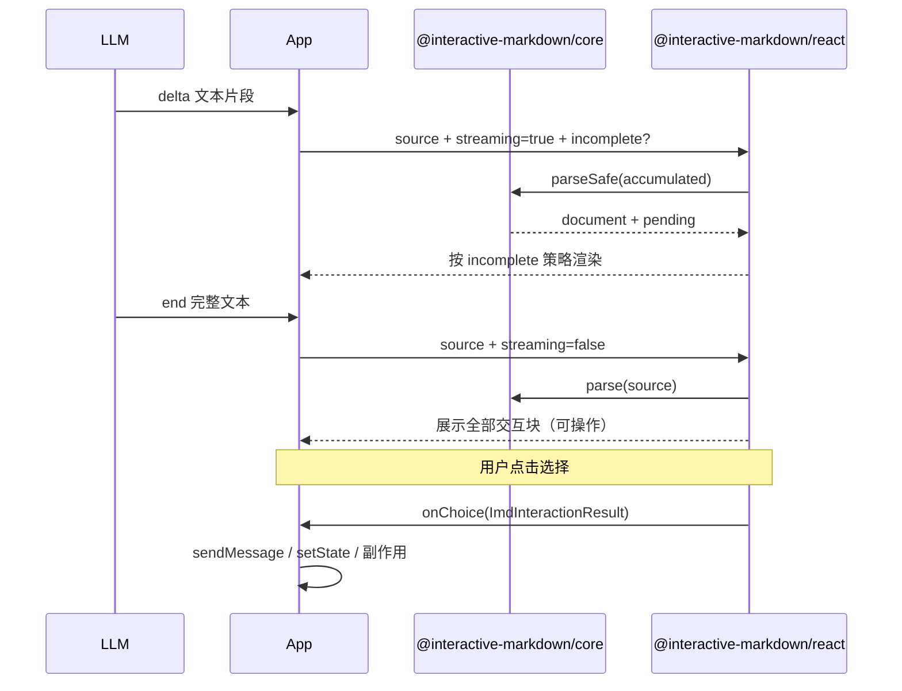

# interactive-markdown 规格说明

## 1. 定位

做一个**与业务无关**的开源库，解决两件事：

1. **流式友好**：AI 边输出边渲染，交互块在未闭合前不展示  
2. **可交互**：在 Markdown 正文中嵌入单选、多选、填写、开关、操作按钮  

业务系统只负责：把 AI 文本喂给库、监听用户操作结果、决定发消息 / 调 API / 推进流程。

---

## 2. 开源库结构

建议 monorepo，npm 发包：

```
interactive-markdown/          # GitHub 仓库名示例
├── packages/
│   ├── core/                  # @interactive-markdown/core — 纯 JS，无 React
│   ├── react/                 # @interactive-markdown/react — React 渲染层
│   └── playground/            # 文档站 + 流式 demo（private）
├── docs/
│   └── spec.md                # 规格说明（本文档）
├── README.md
└── LICENSE (MIT)
```

| 包 | 职责 | 业务耦合 |
|---|---|---|
| `@interactive-markdown/core` | 解析、校验、strip、blocks AST、序列化 | 无 |
| `@interactive-markdown/react` | `InteractiveMarkdown` 组件、交互 UI | 无（仅抛事件） |
---

## 3. 语法规范（IMD — Interactive Markdown）

基于 `remark-directive` 的 `:::` 容器语法。

### 3.1 静态内容

标准 Markdown + GFM（表格、列表、引用、代码块等）。

### 3.2 交互块

```markdown
你好，我们先确认几个偏好。

:::choice{id=login label="你更倾向哪种登录方式？" mode=single required hint="后续可在设置中更换"}
- phone | 手机号登录
- oauth | 第三方账号登录
:::

:::input{id=name label="产品暂定叫什么名字？" placeholder=例如：智能审批助手 required hint="可稍后修改"}
:::

:::switch{id=notify label="是否开启消息通知？" default=off hint="可随时关闭"}
:::

:::action{id=submit label="确认并继续" hint="确认后将进入下一步"}
{"step":"next"}
:::

:::action{id=skip label="暂时跳过"}
:::
```

题干用块属性 `label`（与控件一体，流式时同显隐）；长叙述用普通 Markdown；旁注用可选 `hint`。

**属性引号规则**：值不含空格时可省略引号（如 `label=产品名称`）；含空格 / `"` / `'` / `{}` 时须加引号。引号内同号可用 `\"` / `\'` 转义，也可用相反引号避免转义（`label='他说"好"'`）。

默认 UI 顺序：**label → 表单控件 → hint**。`switch` 为横排例外：同一行 label 与开关**紧邻**（不贴右缘），`hint` 仍在下方。`action` 为单按钮：文案取 `label ?? id`，`hint` 在按钮下方。

### 3.3 块类型

| 类型 | 属性 | 内容 |
|---|---|---|
| `choice` | `id`, `label?`, `mode=single\|multiple`, `required?`, `hint?` | `- value \| label` 行 |
| `input` | `id`, `label?`, `placeholder?`, `required?`, `hint?` | 空或默认值 |
| `switch` | `id`, `label?`, `default=on\|off`, `required?`, `hint?` | 空（无列表体） |
| `action` | `id`, `label?`, `hint?` | 可选 JSON 正文 |

- `switch` 的取值固定为 `"on"` / `"off"`（写入 `values[0]`）；省略 `default` 时为 `off`  
- `switch` 的 `required` 表示**必须开启**（`values` 须为 `["on"]`），用于同意条款等场景  
- `choice` / `input` 的 `required`：供 `isFilled` / 业务校验（choice 至少选 1 项；input 经 trim 后非空）。**多选**勾选变化始终触发 `onChoice`（含空数组）；**单选**点选后触发；**input** 在 `required` 未满足时不触发  
- `input`：**内容变化时**直接触发 `onInput`（无提交按钮）；`required` 未满足时不触发  
- `input` 容器体内若有文本，视为**默认值**；否则为空  
- `action`：一块一按钮；点击产出 `kind: "action"`，`blockId` / `values[0]` = `id`。正文 trim 后非空则 `JSON.parse`：成功写入 `block.data`，失败写入 `block.dataError`（仍可点击）；空正文则两者皆无。业务从 `result.block.data` / `dataError` 取上下文  
- `serialize` 对 `action`：有 `data`（含 `null`）则 `JSON.stringify` 写入正文；仅有 `dataError` 时写**空正文**（错误不写回 MD）。损坏 JSON 的完整回放依赖 `document.source`  
- 其它控件类型（日期、上传、评分等）**暂不支持**
- 流式策略：`parse` + `stripIncomplete` + `parseSafe`；React 通过 `incomplete` 选择 hide / placeholder / progressive

语法稳定、字段少，便于教 LLM 和写校验。

---

## 4. 核心数据模型（`@interactive-markdown/core`）

解析后得到**块列表**，与原始字符串解耦：

```ts
type ImdBlock =
  | { type: "markdown"; text: string }
  | { type: "choice"; id: string; label?: string; mode: "single" | "multiple"; options: { value: string; label: string }[]; required?: boolean; hint?: string }
  | { type: "input"; id: string; label?: string; placeholder?: string; required?: boolean; hint?: string; defaultValue?: string }
  | { type: "switch"; id: string; label?: string; default?: "on" | "off"; required?: boolean; hint?: string }
  | { type: "action"; id: string; label?: string; hint?: string; data?: unknown; dataError?: string };

type ImdDocument = {
  source: string;       // 原始 MD
  blocks: ImdBlock[];   // 结构化块
};
```

### 4.1 `@interactive-markdown/core` 对外 API

```ts
// 完整解析（message.end / 静态文档）
parse(source: string): ImdDocument

// 流式安全文本（message.delta）— 截掉尾部未闭合 :::（hide 策略原语）
stripIncomplete(source: string): string

// 流式增量解析：已闭合块 + 尾部 pending（供 placeholder / progressive）
parseSafe(source: string): {
  document: ImdDocument;
  pending: ImdPendingBlock | null;
}

// 校验
validate(document: ImdDocument): ValidationResult

// 序列化回 MD（测试 / 回放）
serialize(document: ImdDocument): string
```

`ImdPendingBlock`：未闭合指令的部分解析结果（`type` 已知；`id` / 选项行等字段按已稳定解析量填入；含 `raw`）。完整字段见设计文档 `docs/superpowers/specs/2026-07-14-streaming-incomplete-modes-design.md`。

---

## 5. 用户操作后，程序如何拿到结果？

这是库设计的核心。分三层说明：**组件事件 → 结构化载荷 → 业务使用**。

### 5.1 第一层：React 事件回调（最常用）

```tsx
import { InteractiveMarkdown } from "@interactive-markdown/react";

<InteractiveMarkdown
  source={aiText}
  streaming={isStreaming}
  interactive={{
    // 全局：该消息是否已答过（由业务传入）
    disabled: false,

    // 单选 / 多选
    onChoice: (result) => {
      console.log(result);
    },

    // 填写
    onInput: (result) => {
      console.log(result);
    },

    // 开关
    onSwitch: (result) => {
      console.log(result);
    },

    // 操作按钮（非答案型，如「跳过」「查看文档」）
    onAction: (result) => {
      console.log(result);
    },
  }}
/>
```

### 5.2 第二层：统一结果类型（库导出）

所有交互产出同一套 **`ImdInteractionResult`**，业务只处理这一种结构：

```ts
type ImdInteractionResult = {
  kind: "choice" | "input" | "switch" | "action";

  /** 对应块上的 id（action 亦为其 id） */
  blockId: string;

  /** 用户实际值；switch 为 ["on"] 或 ["off"] */
  values: string[];

  /** 原始块定义，便于业务校验 / 取 label */
  block: ImdBlock;

  /** 若业务传入 documentId / messageId，会原样带回 */
  meta?: Record<string, unknown>;
};
```

库**不生成自然语言摘要**（避免多语言与文案锁死）；业务用 `values` + `block` 自行拼展示文案或发给 LLM 的 `content`。

**示例输出：**

单选：

```json
{
  "kind": "choice",
  "blockId": "login",
  "values": ["phone"],
  "block": { "type": "choice", "id": "login", "mode": "single", "options": [...] }
}
```

多选：

```json
{
  "kind": "choice",
  "blockId": "features",
  "values": ["export", "notify"],
  "block": { ... }
}
```

填写：

```json
{
  "kind": "input",
  "blockId": "name",
  "values": ["智能审批助手"],
  "block": { ... }
}
```

开关：

```json
{
  "kind": "switch",
  "blockId": "notify",
  "values": ["on"],
  "block": { "type": "switch", "id": "notify", "label": "消息通知", "default": "off" }
}
```

操作按钮：

```json
{
  "kind": "action",
  "blockId": "submit",
  "values": ["submit"],
  "block": {
    "type": "action",
    "id": "submit",
    "label": "确认并继续",
    "data": { "step": "next" }
  }
}
```

业务从 `result.block.data` 读取可选 JSON 上下文；若正文非法 JSON，则存在 `result.block.dataError`（按钮仍可点击）。

### 5.3 第三层：业务侧如何使用（以聊天为例）

库**只产出结果**，不发送网络请求。业务在回调里决定后续：

```ts
function labelsOf(result: ImdInteractionResult): string[] {
  if (result.block.type === "choice") {
    return result.block.options
      .filter((o) => result.values.includes(o.value))
      .map((o) => o.label);
  }
  if (result.block.type === "action") {
    return [result.block.label ?? result.block.id];
  }
  if (result.block.type === "switch") {
    const on = result.values[0] === "on";
    return [result.block.label ? `${result.block.label}: ${on ? "on" : "off"}` : result.values[0]];
  }
  return result.values; // input：直接用填写值
}

function handleInteraction(result: ImdInteractionResult) {
  // 方式 A：业务自行拼 content 发给 AI（文案 / 语言由业务决定）
  await sendMessage({
    content: labelsOf(result).join("、"),
    replyTo: {
      messageId: agentMessageId,
      blockId: result.blockId,
      kind: result.kind,
      values: result.values,
    },
  });

  // 方式 B：只更新本地状态，不立刻发送
  setAnswers((prev) => ({ ...prev, [result.blockId]: result.values }));

  // 方式 C：action 走副作用（打开页、创建会话等）；上下文在 result.block.data
  if (result.kind === "action") {
    routeToDocument(result.values[0], result.block.data);
  }
}
```

**与 AI 继续对话的推荐约定：**

| 字段 | 用途 |
|---|---|
| `content`（业务拼） | 进入 LLM 上下文（自然语言） |
| `replyTo.blockId` + `values` | UI 标记已答、统计、校验 |
| `replyTo.messageId` | 关联是哪条 AI 消息里的块 |

库不关心 `replyTo` 怎么存库；可选 helper 只组结构化字段，**不生成 content**：

```ts
import { toReplyPayload } from "@interactive-markdown/core";

const replyTo = toReplyPayload(result, { messageId: "msg-123" });
// → { messageId, blockId, kind, values }
```

### 5.4 Headless 用法（无 UI）

不渲染 React，只要解析和结果处理：

```ts
import { parse, stripIncomplete } from "@interactive-markdown/core";

const doc = parse(aiText);
const choices = doc.blocks.filter((b) => b.type === "choice");

// 业务自建 UI，提交时自己构造 ImdInteractionResult
function submitChoice(blockId: string, values: string[]) {
  const block = doc.blocks.find((b) => b.id === blockId);
  const result = buildInteractionResult("choice", block, values);
  onResult(result);
}
```

适合 Vue/Svelte、服务端渲染、单元测试。

### 5.5 多块同屏时的状态

一条 AI 消息可含多个 `choice` / `input` / `switch`。库行为：

| 场景 | 行为 |
|---|---|
| 单选 | 点选 → 触发 `onChoice`（可配置 `submitOnSelect`） |
| 多选 | 勾选变化 → 触发 `onChoice`（无确认按钮；可清空为 `[]`；`required` 仅供校验） |
| 填写 | 内容变化 → 触发 `onInput`（无提交按钮；`required` 未满足时不触发） |
| 开关 | 切换 → 触发 `onSwitch`（`values` 为 `["on"]` / `["off"]`） |
| `disabled: true` | 所有块只读，展示历史答案（由业务传入 `answers`） |

业务传入已答状态：

```tsx
<InteractiveMarkdown
  source={aiText}
  answers={{
    login: { values: ["phone"] },
    name: { values: ["智能审批助手"] },
    notify: { values: ["on"] },
  }}
/>
```

---

## 6. 流式渲染流程



规则：

- **未闭合 `:::`** → `parseSafe` 得到 `pending`；由 `incomplete` 决定如何展示（见下）  
- **流式形成中的行首 `:` / `::` / `:::`** → 同样视为可能的开标签前缀，**不进入可见 Markdown**（避免冒号闪一下再消失）；`streaming=false` / `parse` 仍会折回为正文  
- **开标签行未提交**（仍是最后一行且 source 不以 `\n` 结尾）→ 不出 `pending`（避免 `:::choice` 先出空控件，再被 `:::choice{` 打回隐藏）  
- **闭合但校验失败** → 降级为普通 Markdown 文本  
- **交互块** → 仅已完整闭合的块可操作；pending 一律 `disabled`，不触发回调  

### 6.1 `incomplete` 策略（`streaming=true` 时）

| 值 | 行为 |
|---|---|
| `hide`（默认） | 不渲染 pending（兼容现有 `stripIncomplete` 体验） |
| `placeholder` | 按类型渲染骨架，不展示半解析真实文案/选项 |
| `progressive` | 用已稳定解析的字段渐进渲染控件；choice 选项行凑齐一行再追加；**action 开标签行提交且 `id` 稳定即可展示按钮（不等待 JSON 正文）**；**开标签行未提交前、以及 choice 尚无完整选项行前不渲染** |

可选 `renderPending?.(pending)` 覆盖默认 pending UI。设计细节见 `docs/superpowers/specs/2026-07-14-streaming-incomplete-modes-design.md`。

---

## 7. `@interactive-markdown/react` 技术实现

React **复用 `@interactive-markdown/core` 的 `parse` / `parseSafe` / `stripIncomplete`**，保证前后端 AST 一致；正文 Markdown 用 `react-markdown` + `remark-gfm` 渲染。

```
source
  → streaming=false: parse(blocks)
  → streaming=true:  parseSafe → blocks + pending（按 incomplete / renderPending）
  → markdown 块：react-markdown + remark-gfm
  → choice/input/switch/action：默认组件或 components 覆盖
  → pending：hide | placeholder | progressive（incomplete=true, disabled）
```

- 自定义 UI 通过 `components.Choice|Input|Switch|Action` 覆盖（headless 友好）  
- `BlockComponentProps` 含可选 `incomplete?: boolean`（流式 pending 时为 `true`）  
- 默认组件带轻量 class（`imd-choice` / `imd-action` 等），无强制主题  
- 不依赖 `rehype-raw`（更安全）

```tsx
<InteractiveMarkdown
  source={text}
  streaming={isStreaming}
  incomplete="progressive" // "hide" | "placeholder" | "progressive"
  answers={answers}
  interactive={{
    disabled: false,
    onChoice, onInput, onSwitch, onAction,
  }}
  components={{
    Choice: MyChoice,
    Input: MyInput,
    Switch: MySwitch,
    Action: MyAction,
  }}
/>
```

---

## 8. 开源仓库清单

| 项 | 内容 |
|---|---|
| 仓库名 | `interactive-markdown` |
| npm scope | `@interactive-markdown`（包：`core` / `react`） |
| License | MIT |
| README | 语法说明、Quick Start、流式示例、回调 API |
| 文档站 | `packages/playground`：语法说明 + 流式预览 demo |
| 测试 | core / react Vitest；`npm run coverage` |
| CI | `.github/workflows/ci.yml`：test + coverage + build |
| 版本 | 0.x 语义化；语法变更加 major |

**明确非目标（写进 README）：** 不做聊天 SDK、不做 LLM 调用、不做业务 action 注册表。

---

## 10. 实施阶段

| 阶段 | 内容 | 产出 |
|---|---|---|
| **P0** | `@interactive-markdown/core`：语法、parse、strip、validate、`ImdInteractionResult` | 可独立发布 |
| **P1** | `@interactive-markdown/react`：`InteractiveMarkdown` + 默认 UI + 回调 | 可演示 playground |
| **P2** | 文档站、流式 demo、Vitest 覆盖、CI | GitHub 开源就绪 |

---

## 11. 验收标准

1. 库零业务依赖，可在任意 React 项目 `npm install` 使用  
2. 流式输入无半截交互块闪烁  
3. 单选 / 多选 / 填写 / 开关 / 按钮点击均产出统一 `ImdInteractionResult`  
4. 业务可用 `block` 上的 label + `values` 自行拼对话文案，或只用结构化字段  
5. `answers` + `disabled` 支持历史消息只读回放  
6. core 与 react 解析结果一致，可供后端校验  

---

## 12. 关键设计结论

| 问题 | 结论 |
|---|---|
| 库是否独立？ | 是，`@interactive-markdown/core` + `@interactive-markdown/react`，业务只做集成 |
| 用户点选后程序拿到什么？ | `onChoice` / `onInput` / `onSwitch` / `onAction` → **`ImdInteractionResult`** |
| 怎么给 AI 用？ | 业务用 `values` + `block`（label）自行拼 `content` |
| 怎么给程序用？ | 用 `result.blockId` + `result.values` + `result.kind` |
| 怎么发给后端？ | 业务调用 `toReplyPayload(result)` 或自行组包 |
| 提示文案怎么写？ | 题干用块属性 `label?`；旁注用 `hint?`；长叙述用普通 Markdown。不设独立 `:::hint` 块 |
| 支持哪些控件？ | `choice` / `input` / `switch` / `action`；其它类型暂不支持 |
| 库管不管发送？ | **不管**，只负责解析、渲染、产出结构化结果 |

